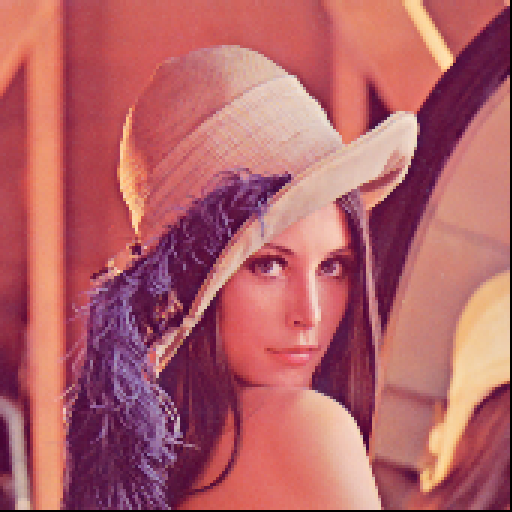
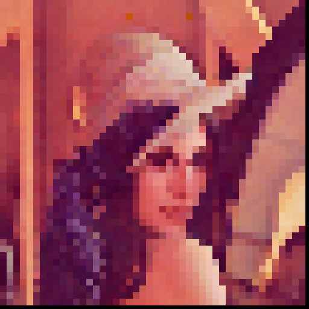
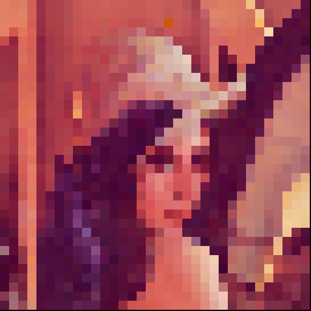

 The script finds the median intensity in a mask for all three color channels and replaces the masked region with the found median.

 ## 1. Example outputs :

  |   |  
| The original image. | Output with 3x3 mask.| Output with 5x5 mask.
  |   |  
| Output with 7x7 mask.| Output with 11x11 mask.| Output with 15x15 mask.

### Usage :
```
pixellate.py <image> <mask>"
```